> [!NOTE]
> 在阅读本文前，请先阅读西电的MoeCTF 2026 Pwn 入门指北，里面大致讲解了pwn的概念和学习路径，以及基础环境搭建教程，故本文不再赘述
> 这里也放一下入门指北里提到的网页：
> [WSL2 环境搭建指南](https://ltfa1l.top/2024/05/01/system/unsorted/%E4%B8%80%E6%AD%A5%E4%B8%80%E6%AD%A5%E9%85%8D%E7%BD%AEPwn%E6%89%8B%E7%9A%84wsl2/#%E5%B0%86%E4%BD%A0%E7%9A%84pwn%E6%96%87%E4%BB%B6%E5%A4%B9%E7%A7%BB%E6%A4%8D%E5%88%B0%E4%BD%A0%E7%9A%84wsl)
> [CTF Wiki - Pwn Environment（中文）](https://ctf-wiki.org/pwn/linux/user-mode/environment/#ctf-pwn)
> [pwn环境搭建](https://blog.csdn.net/j284886202/article/details/134931709)

## 前言

如果按照入门指北把环境跑通后，你确实获得了第一个可用的 **Pwning Environment**

但坦率地说，它离“顺手”还有段距离——原始的配置、繁琐的手动操作，在实战中难免显得低效且笨重

这篇教程将带你重构这个环境，让它变得更智能、简洁、高效，甚至更好看

> [!WARNING]
> 以下内容都是基于个人的体验所撰写的，难免会出现有些片面和不合理的地方，请根据自己的实际情况进行调整

# 准备工作

正如入门指北所言，若只是浅尝辄止，WSL 确实够用且便捷

但若打算长期深入，Linux 虚拟机才是正途——更稳，也省去许多内核层面的兼容麻烦

入门阶段我个人推荐 Kali ，但随着题目复杂度上升、题型逐渐多样化，Ubuntu 的通用性和社区生态优势会愈发明显

:spoiler[典中典之做 MIPS 异架构发现 Debian 的源没有编译 mips 的工具链]

**考虑到上手友好度，本文仍基于 Kali 展开配置**

## 虚拟机

虚拟机和工具链的安装参考这篇文章👉 [pwn环境搭建](https://blog.csdn.net/j284886202/article/details/134931709)

注意把系统换成 kali 官网上专门给虚拟机的系统镜像

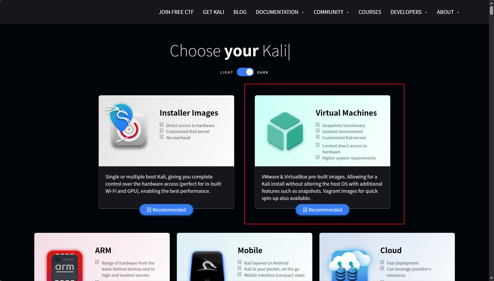

## VSCode

其实就是准备一个好用的 IDE，我个人更喜欢 VSCode 一点

至少需要准备这些插件：

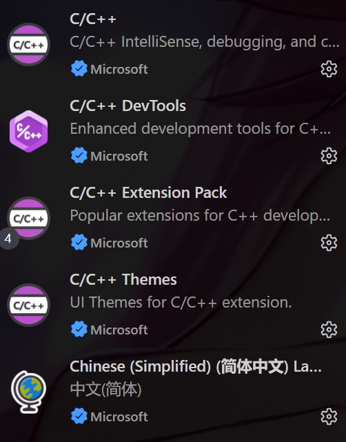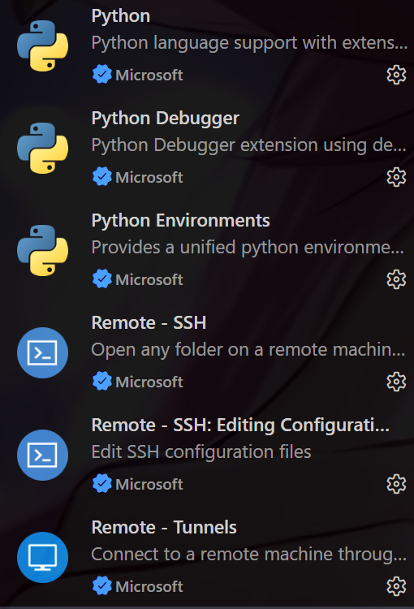

你的 VSCode 至少需要具备能够阅读 C/CPP 和 Python 的能力， SSH 则用来连接虚拟机

## AI Agent

任意 agent 均可，**Claude Code** 和 **Codex** 是最佳选择

后面的演示会以 Codex 桌面端为例

### MCP

目前阶段，IDA Pro 9.X 版本的 MCP 是完全够用的，毕竟大部分 pwn 题基本只会用到 IDA

> [!TIP]
> 虽然我自己用的是 **IDA 9.3** 版本，但很不推荐 9.3 ，体验感上比 9.1 和 9.2 差多了

具体的安装可以参考这篇教程👉 [IDAPro--MCP详细配置教程(通杀)](https://www.cnblogs.com/alexander17/p/19089720)

### Skills

这里推荐一个比较热门的 **Reverse-Skill** ，涵盖了很多 Reverse 和 Pwn 方面的知识库以及 MCP 路由

我感觉体验是不错的

::github{repo="zhaoxuya520/reverse-skill"}

### 配置记忆规则

给 Agent 添加 MEMORY 是很重要的，这样它不会在拿到一个题目时胡乱调用工具甚至污染环境

你可以给 Agent 设定一个工作区，比如创建一个 **“Pwn”** 文件夹，把各个比赛的题目都分类好放在里面

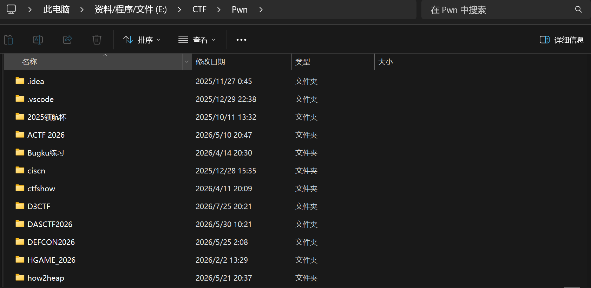

根据你使用的 **linux 终端**，向 Agent 添加记忆，如：

```plaintext
添加记忆：在分析 Pwn 题目时，默认调用 Reverse-skill 进行分析，并通过 SSH 连接 Kali Linux （或 WSL），以 /home/kali/Desktop/Pwn 为主要工作区，GDB 调试与 exp 编写等操作均在 Kali 上完成
涉及到逆向分析时，请调用 IDA MCP
```

这样以后随便打开哪道题，它都会先读取 MEMORY.md ，然后按照你的要求来做

效果：

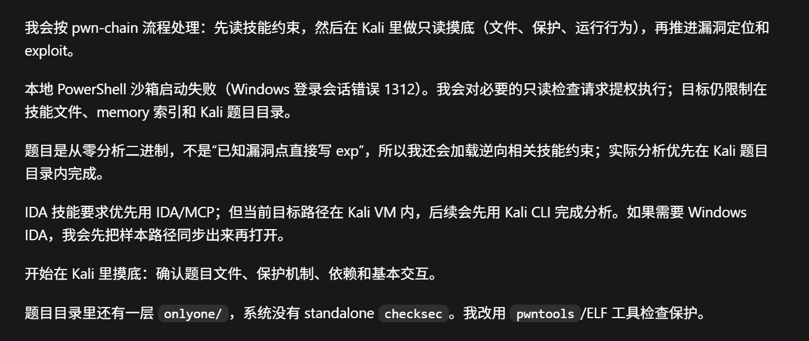

## 网络配置

安装 pwntools 等工具的时候，经常会有网络问题，如果想要只在宿主机上开启代理就能让虚拟机也能科学上网，就需要配置一下 VM 的网络配置

一般来讲可以直接用 NAT 模式

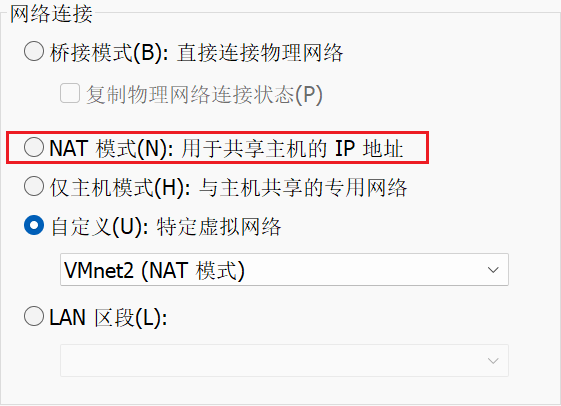

但我这里是自己配了一个 NAT

打开**虚拟网络编辑器**

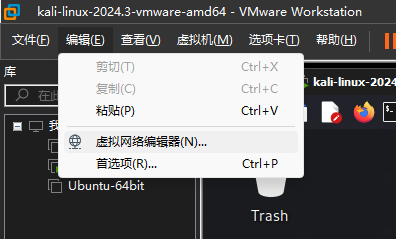

添加一个新的网络，然后选择**更改设置**

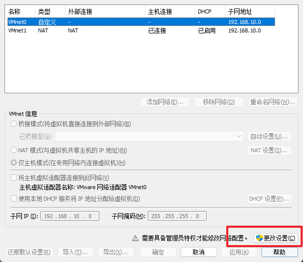

将模式切换为 NAT ，再去配置 DHCP

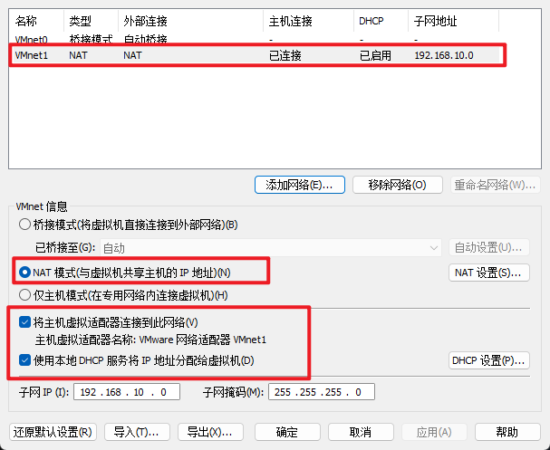

<span style="color: rgb(236, 223, 226)">配置地址分配池，第四位随便，只要不是1开头</span>

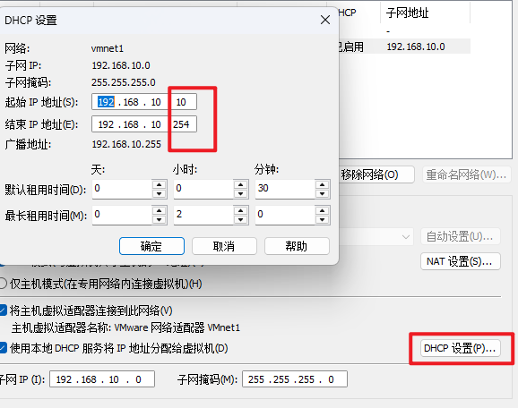

最后切换成自定义的网络配置就行了
记得把 **TUN 模式**打开

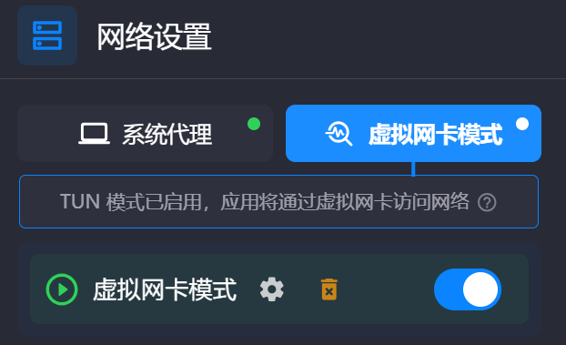

## SSH

Kali 虽然自带桌面环境，但用下来感觉并不算特别顺手，界面也不美观，效率也不高

所以我一般会通过 SSH 把 Kali 连接到 VSCode，这样文件、终端和编辑器都可以放在 VSCode 里处理，Kali 只负责提供运行环境

虚拟机内安装 SSH 服务端：

```bash
sudo apt install openssh-server

sudo service ssh restart #安装完成后重启 ssh 服务
```

然后进入配置文件开放默认端口

```bash
vi /etc/ssh/sshd_config
```

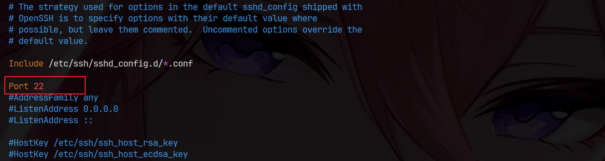

取消注释就行

然后再重启 ssh 服务

VSCode 上安装 SSH 插件后，然后按下 `Ctrl + Shift + P`，搜索：

```
Remote-SSH: Connect to Host
```


第一次连接时选择 `Add New SSH Host`，输入类似下面的命令：

```bash
ssh kali@192.168.’я.100
```

其中 `kali` 是 Kali 中的用户名，后面的 IP 地址替换成虚拟机实际使用的地址

可以用 `ifconfig` 指令查找

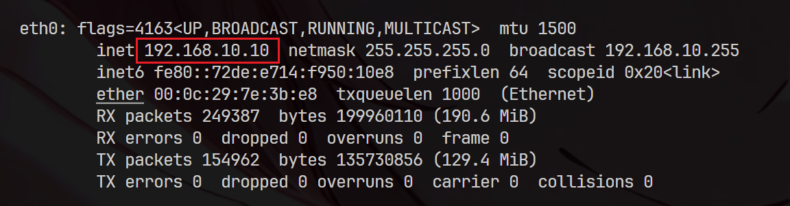

### 配置文件

如果不想每次都手动输入完整的 SSH 命令，可以编辑本地的 SSH 配置文件：

```
C:\Users\你的用户名\.ssh\config
```

没有这个文件的话，直接新建一个，配置内容可以写成这样：

```
 Host kali
    HostName 192.168.10.10
    User kali
    Port 22
```

之后在 VSCode 中连接时，直接选择 `kali` 就可以了

如果使用的是密钥登录，还可以在配置中指定私钥文件：

```
 Host kali
    HostName 192.168.10.10
    User kali
    Port 22
    IdentityFile ~/.ssh/id_ed25519
```

这里的路径建议使用 `/`，可以少处理一些转义问题

### 公私钥配置

使用密码登录当然也可以，但每次连接都输入密码比较麻烦，而且在配置 VSCode Remote - SSH 时也容易遇到一些小问题，因此更推荐使用 SSH 密钥登录，安全性也更高

在 Windows 本地打开 PowerShell，生成一对密钥：

```bash
ssh-keygen -t ed25519
```

一路回车即可，默认情况下，私钥会保存在：

```
C:\Users\你的用户名\.ssh\id_ed25519
```

公钥则是：

```
C:\Users\你的用户名\.ssh\id_ed25519.pub
```

注意，私钥只保存在自己的电脑上，不要上传到 Kali，也不要发给别人，需要复制到 Kali 的只有公钥

可以先使用密码登录 Kali，然后在 Kali 中创建 SSH 配置目录：

```bash
mkdir -p ~/.ssh
chmod 700 ~/.ssh
```

接着把 Windows 中 `id_ed25519.pub` 文件里的内容复制下来，粘贴到 Kali 的公钥文件中：

```bash
vi ~/.ssh/authorized_keys
```

保存后修改权限：

```bash
chmod 600 ~/.ssh/authorized_keys
```

如果 Kali 中已经开启了 SSH 服务，重新连接时就会自动使用密钥登录，遇到连接失败时，可以检查一下 SSH 服务是否正在运行：

```bash
sudo systemctl status ssh
```

如果服务没有启动，可以执行：

```
sudo systemctl start ssh
```

### 修改默认终端

连接成功后，VSCode 打开的终端似乎是默认为 **zsh 或者 bash** ，不习惯也不好用

**Tmux** 是一个更好的选择

在虚拟机里打开相应的配置文件，如果是 bash，就写进 `~/.bashrc`；如果是 zsh，就写进 `~/.zshrc`

我是默认打开为 zsh

```bash
vi ~/.zshrc
```

然后在里面添加这一段：

```bash
if [[ -z "$TMUX" ]] && [[ -n "$PS1" ]]; then
    exec tmux new-session -A -s vscode
fi
```

保存退出

我们还得修改一下 tmux 的配置，让它变得更好用

编辑 `~/.tmux.conf`

```bash
vi ~/.tmux.conf
```

在里面添加这些：

```bash
# 开启鼠标支持：滚动、点击、调整面板全靠鼠标
set -g mouse on
# 增大远端历史记录：VS Code 只留 200 行，这里存 50,000 行
set -g history-limit 50000
# 剪贴板同步：在 tmux 里选中的内容直接进 Windows/Mac 剪贴板
set -g set-clipboard on
# 颜色优化：保证在 VS Code 里看代码高亮是正确的
set -g default-terminal "tmux-256color"
set -ga terminal-overrides ",xterm-256color:Tc"
# 复制模式 copy-mode 使用 vi 风格按键：支持 / 搜索、v 选择、y 复制、n/N 跳转匹配
setw -g mode-keys vi
# 窗口管理：关闭中间窗口后自动重新排序
set -g renumber-windows on

```

# 美化

这部分可看可不看，<span style="color: #0078d4">根据个人喜好来</span>

## Powershell 美化

这部分网上有很多教程，这里放一篇我觉得比较好的，可以参考着来 👉 [美化你的命令行：使用 PowerShell 7 和 Oh My Posh 的终极指南](https://zhuanlan.zhihu.com/p/690118041)

最终效果图：
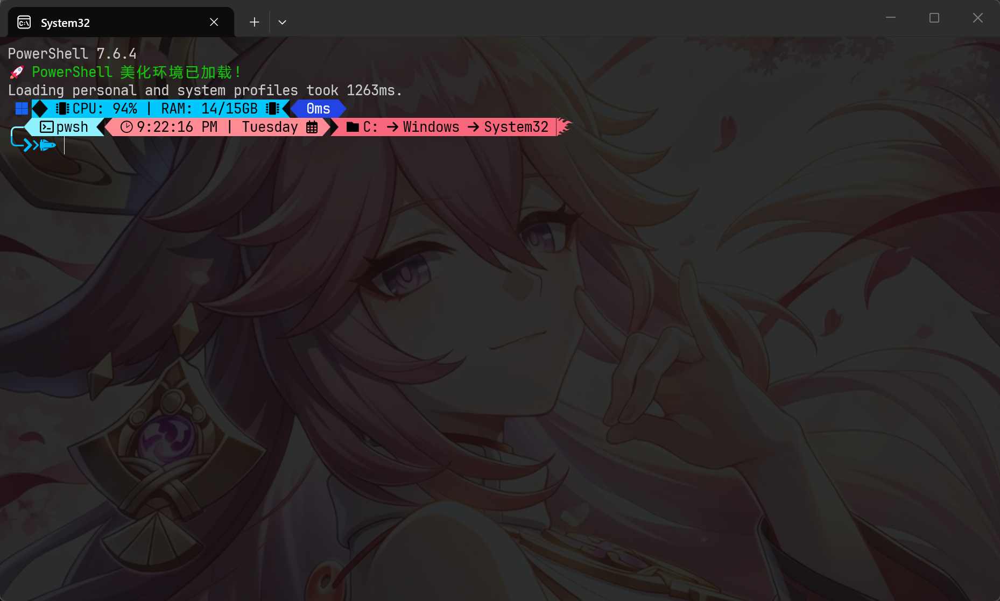

## VSCode 美化

VSCode 的美化核心是 **Background 插件**

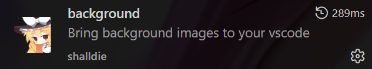

你可以在配置文件里调整各种参数和图片

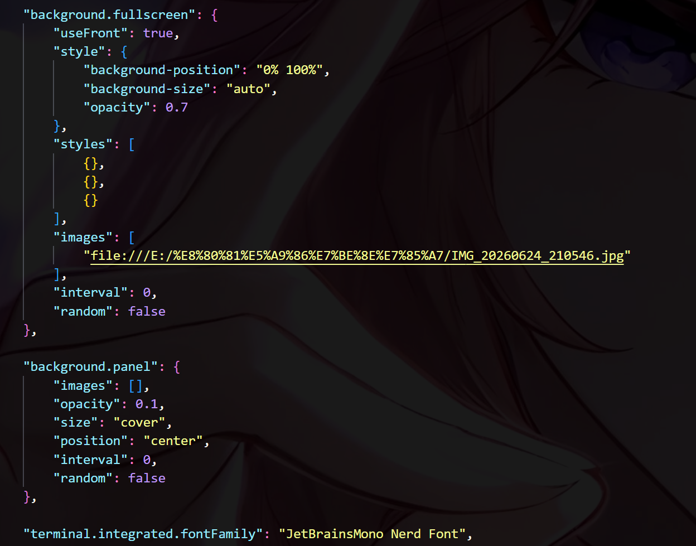

顺便我还会把终端的字体改成 **JetBrainsMono Nerd Font** ，这样还能适配之前美化的 Powershell

最终效果图：

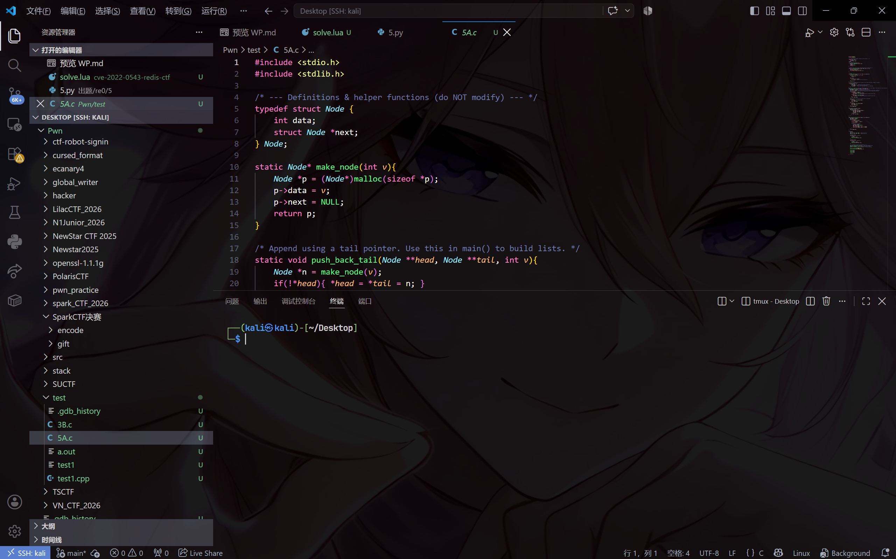

## IDA 美化

这部分我看网上好像很少提起，毕竟也没哪个:spoiler[神]人想着去美化 IDA

直到我在网上冲浪时，无意间找到了 **Reverier-Xu** 师傅曾经制作的两款 IDA 皮肤

::github[repo=“Reverier-Xu/IDA-Skin-VSCode”]

突然感觉这个 IDA 9.3 的原版样式越看越不顺眼，于是尝试 diy 了一下 Reverier-Xu 师傅的皮肤

IDA 从 7.3 起使用基于 CSS 的主题系统，这里的 CSS 实际上主要是 Qt Style Sheets（QSS），再加上 IDA 自己扩展的选择器、属性和 `@importtheme` 指令

主要来说下做了哪些改动

### 字体

```css
.disasm-font {
  font-family: 'JetBrains Mono', monospace;
  font-size: 14pt;
}

.hexview-font {
  font-family: 'JetBrains Mono', monospace;
  font-size: 14pt;
}

.text-input-font {
  font-family: 'JetBrains Mono', monospace;
  font-size: 14pt;
}
```

### 背景图

```css
CustomIDAMemo {
  qproperty-line-bg-default: rgba(0, 0, 0, 0);
  background: #1e1e1e url("$RELPATH/background-dark.jpg");
  background-attachment: fixed;
  background-repeat: no-repeat;
  background-position: center;
}

ecfringe_t,
TextArrows {
  background: transparent;
}

IDAViewHost {
  background: #1e1e1e;
}
```

想要修改背景图，就把 $RELPATH 改一下就行

但 IDA 确实不适合美化，以背景图缩放为例

Qt 的 `background-image` 支持定位和平铺，但不会像网页 CSS 那样支持可靠的 `background-size: cover` 或 `contain`，图片尺寸和视图尺寸不一致时，图片保持原像素大小，只根据 `background-position` 对齐

同时，QSS 不方便在一张完全不透明的 JPEG 上再叠加半透明黑色遮罩

图片还是得提前预先处理

最终效果图：

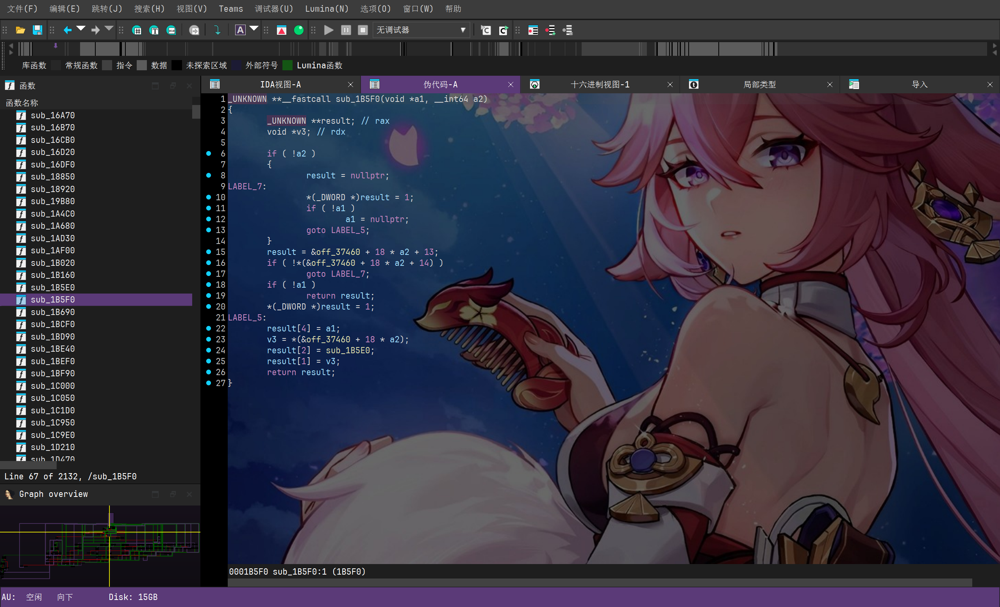
