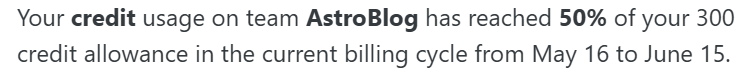
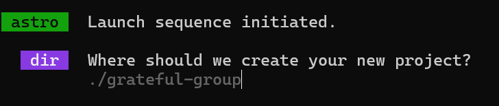
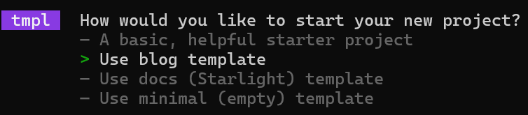
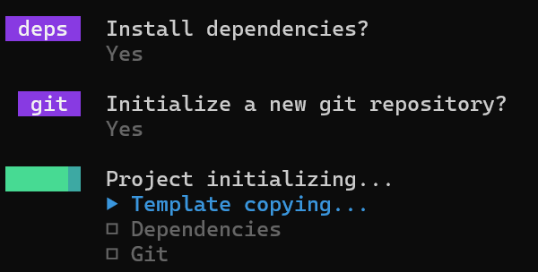
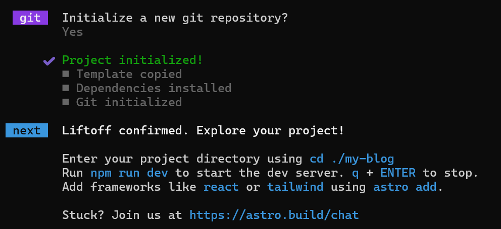
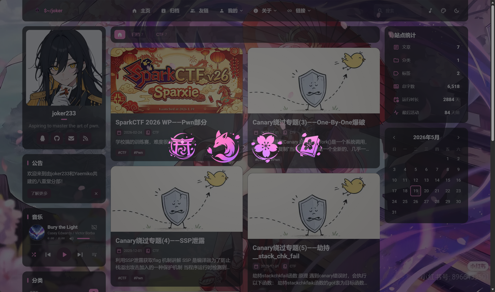

## 前言
经历了漫长的考试周后，终于有时间来好好搞一下这个博客了

这段时间断断续续的给配置文件搞个性化配置和一些小功能的开发，后续的功能以后再开发吧

## 为什么换到Astro？

静态博客的优势也不赘述了

**成本低廉，维护简单，访问速度快，安全性强，离线写作......**

相比于老牌的传统框架，如 **Hexo、Hugo** 等，他们性能优秀，社区庞大且成熟

而 **Astro** 带来的，则是更加现代化和更加极致的体验

为了更直观地理解它们的区别，这里整理了一张表格：

| 特性            | Astro                              | Hugo                       | Hexo                    |
| :-------------- | :--------------------------------- | :------------------------- | :---------------------- |
| **核心语言**    | JavaScript (Node.js)               | Go                         | JavaScript (Node.js)    |
| **加载性能**    | **极佳** (默认零JS, 按需加载)      | 优秀 (JS 体积小)           | 良好 (依赖插件和主题)   |
| **构建速度**    | 快                                 | **极快**                   | 一般                    |
| **开发语法**    | 类 JSX 的 `.astro` 文件            | Go 的 `html/template` 语法 | EJS, Pug 等多种模板引擎 |
| **UI 框架支持** | **可以混用** React, Vue, Svelte 等 | 不支持，需手动引入 JS      | 不支持，需手动引入 JS   |

尽管如此，**Astro** 最主要的优势在于其 **Astro Islands** 架构

传统框架会把整个页面当成一个完整的应用去加载 JS，而 Astro 默认**不向浏览器发送任何 JavaScript**

只有在需要交互式组件时，才会将其作为一个独立的“岛屿”进行“hydration”

同时，**框架自由** 使得我们能在 **Astro** 中使用各种不同的技术，开发出不同的功能；而对于 **Markdown** 和 **MDX** 的超强支持，让文章能够包含各种复杂的UI组件，使文章不再单调

### 一些小问题

吹完以后，再来说一些小问题（

从动态部署的 **Typecho** 转到静态网站，最不适应的就是写文章和个性化配置

以前更新文章，可以通过进入网站后台，直接在后台的编辑器上写，写完直接推送

个性化的配置也可以在所使用主题的后台进行配置，相当方便快捷~~（尤其是我花了89买的Handsome主题，心痛啊）~~

现在的话，写完一篇文章还得git推送~~（本来git就用的不多）~~尤其是知道每次推送构建要消耗 **Netlify** 额度时，就更不想写了（



------

## 搭建过程

下文仅陈述我自己的搭建过程

### 挑选模板

工欲善其事，必先利其器

挑选一款的好的模板是做blog不得不品的一环啊

目前比较主流的 **Astro Blog** 模板是 **Fuwari** 

::github{repo="saicaca/fuwari"}

我目前使用的是基于 **Fuwari** 二次开发的 **Firefly**，界面清新，功能较多，很有二次元感觉

::github{repo="CuteLeaf/Firefly"}

### 环境部署

正式部署前，需要在本地配置好开发环境

#### 安装Node.js和创建Astro项目

``````shell
node -v
npm -v
``````

安装时记得勾选**”Add to PATH”**

```shell
npm create astro@latest
```

这里随便输个名字，比如`my-blog`



这里选择blog



后面两项直接选`Yes`，然后等待构建完成





在相应目录下输入指令，就可以开启生产环境了

```shell
npm run dev
```

> [!NOTE]
>
> Windows下需要用 **cmd** 来运行

### 简单部署

如果用现成的模板，比如我现在用的 **Firefly** ，我们完全可以省略很多步骤

克隆仓库

```shell
git clone https://github.com/CuteLeaf/Firefly.git
cd Firefly
```

安装依赖

```shell
pnpm install
```

启动开发服务器

```shell
pnpm dev
```

构建生产版本

```shell
pnpm build
```

### 项目结构

这是一个基础的项目结构

```shell
my-blog/
├── src/
│   ├── pages/           # 路由页面，文件名就是URL
│   ├── layouts/         # 布局模板（头部、底部等）
│   ├── components/      # 可复用组件（按钮、卡片等）
│   └── content/         # 你的Markdown文章存这里
├── public/              # 静态资源（图片、字体、favicon）
├── astro.config.mjs     # Astro配置文件
└── package.json         # 项目依赖
```

后续的开发和写文章就围绕这个目录进行就可以了

### 部署上线

理论上讲，任何的静态部署托管平台都可以，这里我选择的是 **Netlify** 

流程很简单

1. 去 [netlify.com](https://www.netlify.com/) 注册账号
2. 点击”Add new site” → “Import an existing project”
3. 连接GitHub，选择你的仓库
4. 构建设置：
   - Build command: `npm run build`
   - Publish directory: `dist`
5. 点击”Deploy”

平台会给一个`xxx.netlify.app` 的域名，访问测试

当然，如果你有自己的域名，也可以DNS解析到它给你的地址后，用你自己的域名访问

------

## 一些小改动

### 过渡加载动画

初次访问网站的时候会出现这个动画



制作了一些小素材，我个人感觉看起来还是挺有神子的风味的（雷元素、狐狸、樱花、轻小说）

#### 1. 加载层 DOM

```javascript
<div id="site-loading-screen" aria-hidden="true">
   <div class="site-loading-dots">
      <span class="site-loading-dot">·</span>
      <span class="site-loading-dot">·</span>
      <span class="site-loading-dot">·</span>
      <span class="site-loading-dot">·</span>
   </div>
</div>
```

#### 2. 随机替换和淡出逻辑

```javascript
<script is:inline data-swup-ignore-script define:vars={{ loadingImages }}>
   (() => {
      const loader = document.getElementById("site-loading-screen");
      if (!loader) return;

      const dots = Array.from(loader.querySelectorAll(".site-loading-dot"));
      const availableIndexes = dots.map((_, index) => index);
      const availableImages = [...loadingImages];
      const reducedMotion = window.matchMedia("(prefers-reduced-motion: reduce)").matches;
      const stepDelay = reducedMotion ? 80 : 455;
      const fadeDelay = reducedMotion ? 80 : 310;
      let currentStep = 0;

      const pickRandom = (items) => {
         const randomIndex = Math.floor(Math.random() * items.length);
         return items.splice(randomIndex, 1)[0];
      };

      const finish = () => {
         window.setTimeout(() => {
            loader.classList.add("is-hiding");
            window.setTimeout(() => loader.remove(), reducedMotion ? 120 : 700);
         }, fadeDelay);
      };

      const advance = () => {
         if (currentStep >= dots.length || availableIndexes.length === 0) {
            finish();
            return;
         }

         const dotIndex = pickRandom(availableIndexes);
         const image = pickRandom(availableImages);
         const dot = dots[dotIndex];

         dot.classList.add("is-image");
         dot.textContent = "";
         dot.innerHTML = ``;

         currentStep += 1;
         currentStep >= dots.length ? finish() : window.setTimeout(advance, stepDelay);
      };

      window.setTimeout(advance, reducedMotion ? 40 : 250);
   })();
</script>
```

#### 3. 遮罩和淡出样式

```css
#site-loading-screen {
   position: fixed;
   inset: 0;
   z-index: 2147483647;
   display: grid;
   place-items: center;
   backdrop-filter: blur(18px) saturate(1.25);
   -webkit-backdrop-filter: blur(18px) saturate(1.25);
   transition: opacity 650ms ease, backdrop-filter 650ms ease;
}

#site-loading-screen.is-hiding {
   opacity: 0;
   backdrop-filter: blur(0) saturate(1);
   -webkit-backdrop-filter: blur(0) saturate(1);
   pointer-events: none;
}
```

#### 4. 点位布局和入场动画

```css
.site-loading-dots {
   display: grid;
   grid-template-columns: repeat(4, 7.6rem);
   gap: 1.25rem;
}

.site-loading-dot {
   display: grid;
   width: 8.75rem;
   height: 8.75rem;
   place-items: center;
   font-size: 4.85rem;
}

.site-loading-dot.is-image {
   animation: loading-dot-pop 220ms cubic-bezier(0.2, 0.9, 0.35, 1.25) both;
}

.site-loading-dot img {
   width: 100%;
   height: 100%;
   object-fit: contain;
}

@keyframes loading-dot-pop {
   from {
      opacity: 0;
      transform: rotate(-60deg) scale(0.76);
   }
   68% {
      opacity: 1;
      transform: rotate(30deg) scale(1.07);
   }
   to {
      opacity: 1;
      transform: rotate(0deg) scale(1);
   }
}
```

------

### 后续打算

上方导航栏可能会添加一个**“应用”**界面，主要放一些实用的小工具和自己的其他网站

后续可能还会再加一些其他的功能性装饰吧，让主题更契合**八重堂**这个主题

优化和SEO后面再搞
